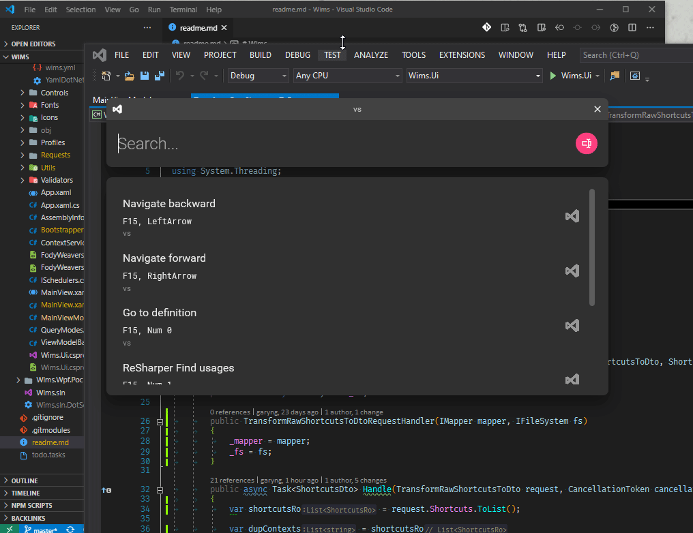

# Wims


> — because I can't remember them

# Demo

## Search by text


## Search by keys


## Context-awareness

Shortcuts will be filtered based on the current active window.



## Removing context

Removing context will list all shortcuts.


# Installation

1. Install [`scoop`](https://scoop.sh/)
1. Add [`scoop-garyng`](https://github.com/garyng/scoop-garyng/) bucket with `scoop bucket add garyng https://github.com/garyng/scoop-garyng.git`
1. Install with `scoop install Wims`

# Usage

## Global configuration

A `yaml` file for configuring the app's behavior.

```yaml
directory: shortcuts
activation: LWin + Escape
autoHide: true
topmost: true
```

- `directory`: the directory that contains the [shortcuts file](#shortcuts-file).
- `activation` (optional): the shortcut key to activate the main window (see [Keys enum](https://docs.microsoft.com/en-us/dotnet/api/system.windows.forms.keys?view=netcore-3.1) for available keys)
  - Default value: `LWin + Escape`
- `autoHide` (optional): automatically hides the window when focus is lost
  - Default value: `false`
- `topmost` (optional): keep the window always on top
  - Default value: `false`

Order of configuration precedence:

1. `wims.yml` at home directory
1. `wims.yml` at the same directory as the app's exe

The last loaded config key wins.

## Shortcuts file

- A shortcut file is a `yaml` file made up of 2 main sections:
  - [`contexts`](#contexts)
  - [`shortcuts`](#shortcuts)

### `contexts`

A `context` is used to determine whether a shortcut is active based on the current active window.

For example, here is a `context` that matches a Visual Studio window:

```yaml
contexts:
  "vs":
    icon: vs.png
    match:
      exe: devenv.exe
```

- `"vs"`: the name of the context, which can be used by a `shortcut`.
- `icon`: the path to an image. `svg` is also supported.
- `match`  (optional): the conditions for determining whether the context is active.
  - `exe`: match the process name of the current active window. Normally using `exe` is sufficient enough.
  - `class`: match the class name of the current active window.
  - Regex can be used in both `exe` and `class`, just wrap them inside `//`, eg: `/*.exe/`

Here is another `context` that matches a Visual Studio Code window:

```yaml
contexts:
  "vscode":
    icon: vscode.svg
    match:
      exe: code.exe
```

### `shortcuts`

A `shortcut` defines a shortcut, optionally associated with a [`context`](#contexts).

For example, below are 2 shortcuts (the first is global, the second is associated with the context `vs`):

```yaml
shortcuts:
  "Toggle active window always on top":
    sequence:
     - Alt + F1
  "Navigate backward":
    context: vs
    sequence:
      - F15
      - LeftArrow
```

- `"Navigate backward"`: the name of the shortcut.
  - This is used for matching the search query when [searching with text](#search-by-text).
- `context`  (optional): the name of the [`context`](#contexts).
  - If this is left empty, the shortcut is considered as "global", and will be active only when there is no active context.
- `sequence`: a sequence of chords that are pressed subsequently, eg: `Ctrl + K, Ctrl + F`
  - A chord is a sequence of keys that are pressed at the same time, eg: `Ctrl + Shift + P`
  - This is used for matching the search query when [searching with keys](#search-by-keys).

# Development

1. `git clone --recurse-submodules` as this repo uses submodules