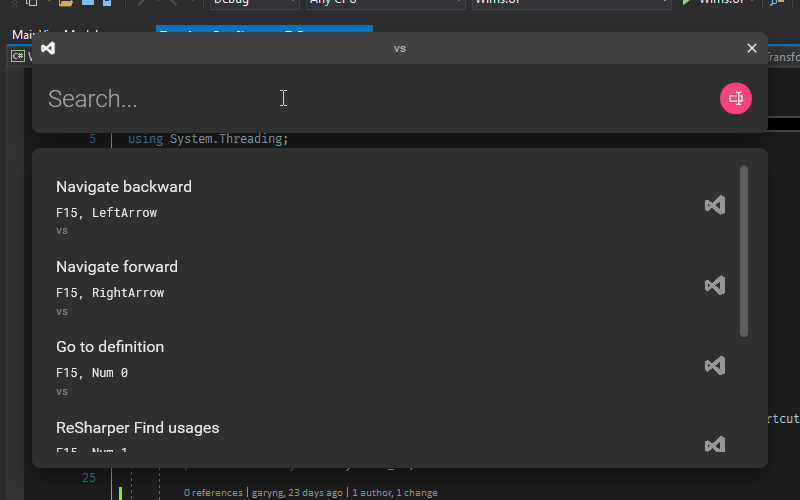

# Wims


> — because I can't remember them

# Demo

## Search by text


## Search by keys


## Context-awareness

Shortcuts will be filtered based on the current active window.


## Removing context

Removing context will list all shortcuts.



# Installation

- [ ] choco?

# Usage

## Global configuration

A `yaml` file for configuring the app's behavior.

```yaml
directory: shortcuts
```

- `directory` specifies the directory that contains the [shortcuts file](#shortcuts-file).

## Shortcuts file

- A shortcut file is a `yaml` file made up of 2 main sections:
  - [`contexts`](#contexts)
  - [`shortcuts`](#shortcuts)

### `contexts`

A `context` is used to determine whether a shortcut is active based on the current active window.

For example, here is a `context` that matches a Visual Studio window:

```yaml
contexts:
  "vs":
    icon: vs.png
    match:
      exe: devenv.exe
```

- `"vs"` is the name of the context, which can be used by a `shortcut`.
- `icon` contains the path to an image. `svg` is also supported.
- `match` contains the conditions for determining whether the context is active.
  - `exe` will match the process name of the current active window. Normally using `exe` is sufficient enough.
  - `class` will match the class name of the current active window.
  - Regex can be used in both `exe` and `class`, just wrap them inside `//`, eg: `/*.exe/`

Here is another `context` that matches a Visual Studio Code window:

```yaml
contexts:
  "vscode":
    icon: vscode.svg
    match:
      exe: code.exe
```

### `shortcuts`

A `shortcut` defines a shortcut, optionally associated with a [`context`](#contexts).

For example, below are 2 shortcuts (the first is global, the second is associated with the context `vs`):

```yaml
shortcuts:
  "Toggle active window always on top":
    sequence: 
     - Alt + F1
  "Navigate backward":
    context: vs
    sequence:
      - F15
      - LeftArrow
```

- `"Navigate backward"` is the name of the shortcut.
  - This is used for matching the search query when [searching with text](#search-by-text).
- `context` is the name of the [`context`](#contexts).
  - If this is left empty, the shortcut is considered as "global", and will be active only when there is no active context.
- `sequence` is a sequence of chords that are pressed subsequently, eg: `Ctrl + K, Ctrl + F`
  - A chord is a sequence of keys that are pressed at the same time, eg: `Ctrl + Shift + P`
  - This is used for matching the search query when [searching with keys](#search-by-keys).
# Development

1. `git clone --recurse-submodules` as this repo uses submodules